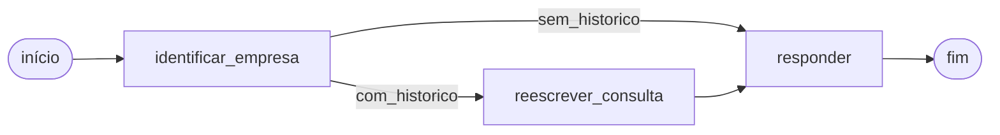
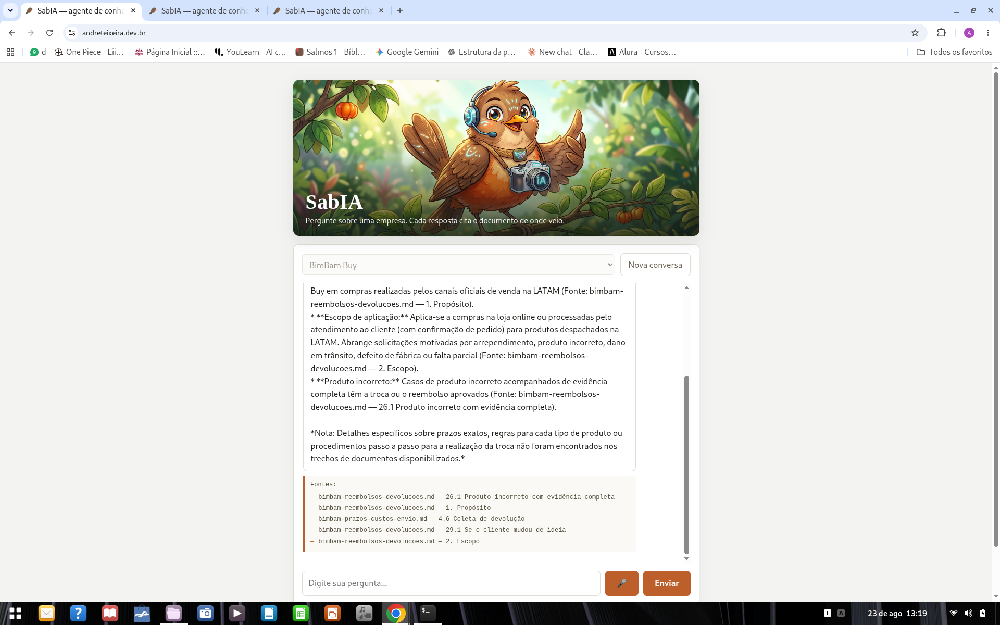
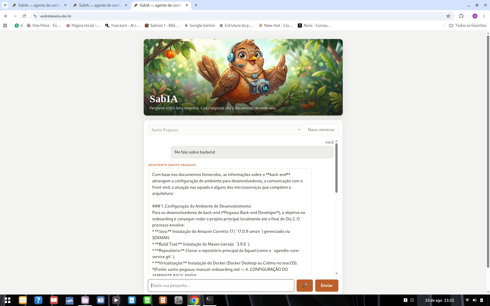
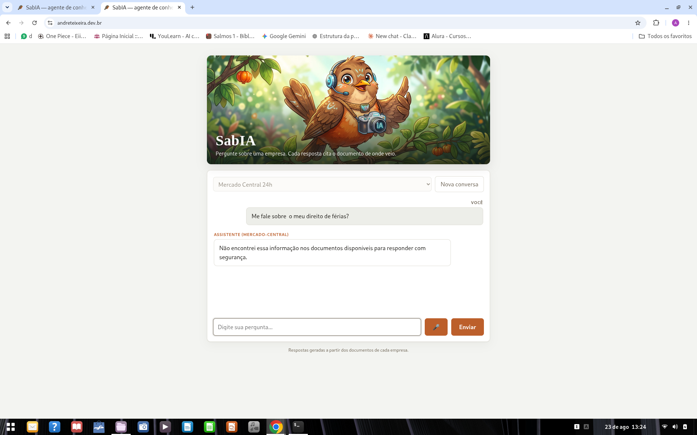

# SabIA — agente RAG multi-empresa

Agente conversacional que responde perguntas sobre a documentação interna de três empresas
fictícias, mantendo isolamento estrito entre elas: a mesma pergunta feita a empresas
diferentes recupera documentos diferentes e produz respostas diferentes.

Projeto do **Challenge RAG — Alura / Oracle ONE (Tech AI Builder)**.

🔗 **Aplicação no ar:** https://andreteixeira.dev.br

O nome vem do sabiá — pássaro brasileiro conhecido pelo canto, com "IA" no meio e um aceno
a "sábio". A interface aceita pergunta por voz, o que fecha o trocadilho.

---

## O problema

Três empresas, 14 documentos, um só agente. O risco central de um RAG multi-tenant é o
vazamento entre bases: perguntar "qual o prazo de arrependimento?" precisa devolver a
política da BimBam Buy quando o contexto é BimBam, e a do Mercado Central quando é Mercado
Central — sem misturar, e sem inventar quando a resposta não existe em documento nenhum.

| Empresa | Identificador | Domínio dos documentos |
|---|---|---|
| BimBam Buy | `bimbam` | e-commerce — pagamentos, envio, garantia, reembolso, afiliados |
| Mercado Central 24h | `mercado-central` | varejo alimentar — SOP, fornecedores, trocas, FAQ |
| Santo Pegasus | `santo-pegasus` | engenharia de software — arquitetura, onboarding, SRE, guias |

---

## Arquitetura

Camadas simples, deliberadamente não hexagonal. Duas portas isoladas, e apenas duas:
`EmbeddingProvider` (permite trocar o provedor de embeddings) e `VectorStore` (permite
trocar o pgvector). Tudo o mais é implementação direta.

### Fluxo do grafo



Três nós, com aresta condicional em `identificar_empresa`:

- **`identificar_empresa`** — resolve a empresa da sessão. Regra de produto: a empresa fica
  fixa até o fim da conversa; tentar trocá-la no meio é ignorado, e mudar exige nova thread.
- **`reescrever_consulta`** — só alcançado quando há histórico. Transforma "e para
  hortifrúti?" numa pergunta autossuficiente, sem a qual a busca vetorial não recupera nada
  útil. É uma chamada ao modelo de chat.
- **`responder`** — recuperação filtrada por empresa, aplicação do limiar e geração da
  resposta com citação de fonte.

**Estado:** empresa selecionada + histórico em janela deslizante de 6 turnos.
**Checkpointing:** `langgraph4j-postgres-saver`, no mesmo Postgres do pgvector. As tabelas
vêm da migração `V3__grafo_checkpoints.sql`, com `createTables(false)` explícito — schema é
responsabilidade do Flyway, nunca de criação automática.

### As duas comportas contra alucinação

O sistema recusa em dois pontos distintos, e isso é intencional:

1. **Comporta 1 — limiar de similaridade.** Se o melhor chunk fica abaixo de `0.68`, a
   pergunta é barrada antes de chegar ao LLM. Nenhuma chamada de geração acontece.
2. **Comporta 2 — prompt de sistema.** Quando o contexto recuperado é topicamente
   relacionado mas não contém o fato pedido, o limiar sozinho deixa passar. O prompt exige
   que o modelo admita ausência em vez de completar a lacuna.

A comporta 2 existe porque a separação por limiar **não é limpa**. Perguntar o CNPJ da
BimBam recupera chunks de pagamento e logística com score `0.7759` — acima do limiar, e
ainda assim sem a resposta. Um limiar mais alto barraria fatos legítimos: o menor score
entre perguntas com resposta real foi `0.7201`.

---

## Tecnologias

| Camada | Escolha |
|---|---|
| Linguagem / runtime | Java 21 |
| Framework | Spring Boot 4.1.0 |
| Orquestração de LLM | LangChain4j 1.18.1 |
| Grafo de estado | LangGraph4j 1.9.0-beta2 (`langgraph4j-core` + `langgraph4j-postgres-saver`) |
| Banco vetorial | PostgreSQL 16 + pgvector |
| Migrações | Flyway (`V1` chunks, `V2` chunks recursivo, `V3` checkpoints) |
| Embeddings | `gemini-embedding-001`, 768 dimensões, normalização L2 manual |
| Geração | `gemini-3.6-flash` |
| Interface | HTML/JS estático servido pelo próprio Spring Boot |
| Entrada por voz | Web Speech API (`SpeechRecognition`), `pt-BR` |
| Testes | JUnit 5, AssertJ, Mockito |
| Deploy | OCI Ampere A1 (ARM64), Ubuntu 24.04, systemd, Caddy + Let's Encrypt |

---

## Como executar

### Pré-requisitos

- Java 21
- Docker e Docker Compose
- Uma chave de API do Google AI Studio

### 1. Banco

```bash
docker compose up -d
```

Sobe `pgvector/pgvector:pg16` na porta **5434** (não a 5432, para não colidir com um
Postgres local), banco `agenterag`, usuário e senha `rag`. O Flyway aplica as migrações no
boot da aplicação.

### 2. Chave de API

Crie um arquivo `.env` na raiz do projeto:

```properties
GEMINI_API_KEY=sua-chave-aqui
```

```bash
chmod 600 .env
```

O `.env` é carregado por `spring.config.import: optional:file:.env[.properties]`. **O
sufixo `[.properties]` é obrigatório** — sem ele o Spring não reconhece a extensão, ignora
o arquivo em silêncio e a chave chega ao Google como o literal `${GEMINI_API_KEY}`.

### 3. Ingestão

Roda uma vez, por perfil dedicado, e encerra:

```bash
./mvnw spring-boot:run -Dspring-boot.run.profiles=ingest
```

Nunca ingere no boot da aplicação web. Há guarda de idempotência: se a tabela já tem
chunks, a ingestão é pulada.

⚠️ A ingestão respeita `pausa-entre-chamadas-ms: 65000` — 65 segundos entre documentos,
para caber no limite de embeddings por minuto do free tier. Ingerir os 14 documentos leva
cerca de 15 minutos, e isso é esperado.

### 4. Aplicação

```bash
./mvnw spring-boot:run
```

Interface em `http://localhost:8080`, health em `/health`.

### Variáveis de ambiente

| Variável | Default | Observação |
|---|---|---|
| `GEMINI_API_KEY` | — | obrigatória |
| `DB_URL` | `jdbc:postgresql://localhost:5434/agenterag` | |
| `DB_USERNAME` | `rag` | |
| `DB_PASSWORD` | `rag` | |
| `SERVER_PORT` | `8080` | em produção, `8000` via systemd |

### Perfil alternativo de chunking

```bash
./mvnw spring-boot:run -Dspring-boot.run.profiles=recursivo
```

Troca a estratégia híbrida pela recursiva e aponta para a tabela `document_chunks_recursive`.
Existe para tornar a decisão de chunking mensurável, não teórica — ver seção de avaliação.

---

## Testes

```bash
./mvnw test
```

17 testes, todos offline. **Exige Docker**: o teste de integração sobe o próprio container.

Testes que consomem API paga levam `@Tag("llm")` e ficam **fora** do `mvn test` padrão. Para
rodar um deles explicitamente:

```bash
./mvnw test -Dtest=NomeDaClasse -Dgroups=llm -Dsurefire.excludedGroups=
```

O `-Dsurefire.excludedGroups=` é obrigatório. Um valor literal em `<excludedGroups>` não
pode ser sobrescrito por `-D` — o XML da configuração do plugin vence a propriedade de
sistema, mesmo com nome idêntico. Por isso o `pom.xml` referencia uma property em vez de
fixar o valor.

Esses testes também respeitam uma pausa configurável entre chamadas
(`-Dpausa.resposta.ms`, `-Dpausa.conversa.ms`), para caber no limite de requisições por
minuto do free tier. Sem ela, a suíte estoura no meio e falha sem produzir resultado.

O harness de avaliação lê vetores de uma fixture versionada
(`src/test/resources/query-embeddings-fixture.json`), então mede retrieval em todas as
perguntas do conjunto **sem chamar a API**.

### O teste que vale mais que os outros

`IngestaoIntegrationTest` sobe um Postgres real com pgvector via Testcontainers, aplica as
três migrações do Flyway e injeta um `EmbeddingProvider` determinístico — nenhuma chamada de
rede.

O caso central prova o invariante do projeto com uma armadilha deliberada: **o vetor de um
documento da BimBam é construído mais próximo da pergunta do que o vetor correto do Mercado
Central.** Numa busca filtrada por `mercado-central`, ele ainda assim não aparece.

Isso demonstra que o isolamento entre empresas é propriedade do filtro no banco, não
confiança na geometria do embedding. Um teste que só verificasse "a busca retorna o
documento certo" passaria mesmo se o filtro fosse removido.

---

## Exemplos de perguntas

**Fatos precisos**
- Quais métodos de pagamento a BimBam Buy aceita?
- Quantos dias de férias um colaborador CLT da Santo Pegasus tem direito após completar 12 meses?
- Qual a temperatura ideal para produtos congelados? *(mercado-central)*

**Colisão entre empresas** — mesma pergunta, respostas diferentes
- Qual o prazo para desistir da compra por arrependimento? *(bimbam vs. mercado-central)*

**Follow-up com histórico** — exige reescrita de consulta
- *"Qual a temperatura ideal para produtos congelados?"* → *"E para hortifrúti?"*
- *"Quantos dias de férias um colaborador CLT tem direito?"* → *"E qual o período mínimo de descanso após ser acionado de madrugada?"*

**Recusa esperada**
- Qual o CNPJ da BimBam Buy? *(fora de escopo, mas topicamente próximo — comporta 2)*
- Qual a capital da França? *(fora de escopo, barrado pela comporta 1)*

---

## Avaliação de retrieval

Conjunto versionado em `src/test/resources/avaliacao.yaml`, em quatro categorias: fatos
precisos, colisões entre empresas, fora de escopo e ambiguidades. Todos os valores esperados
foram lidos dos documentos na etapa de conversão e registrados em `docs/FATOS_VERIFICADOS.md`
antes de virarem asserção — nenhum foi presumido.

Na execução as entradas são achatadas em **43 casos** (colisões expandidas por empresa).
Destes, 36 têm documento esperado; os outros 7 são recusa pura, sem documento a recuperar.

| Estratégia de chunking | Chunks | Documento no top-5 | Documento na posição 1 | Seção correta |
|---|---|---|---|---|
| **Híbrida (por cabeçalho)** — padrão | 719 | 36/36 — 100% | 29/36 — 81% | 17/27 — 63% |
| Recursiva pura | 484 | 35/36 — 97% | 34/36 — 94% | não aplicável |

> **A recursiva ganha em posição 1 e ainda assim foi descartada.** A razão não é a métrica
> agregada, e sim o **tipo de erro** de cada estratégia.
>
> O erro da híbrida é de **ranking**: nos 7 casos fora da primeira posição o documento certo
> está nas posições 2 a 4. Como a busca usa `limit=5`, esses casos entram no contexto do LLM
> de qualquer forma — os 81% subestimam o que o sistema realmente entrega.
>
> O erro da recursiva é de **cobertura**: em `mercado-central-cnpj` o documento correto não
> aparece em nenhuma das cinco posições. Nenhum ajuste de `limit` razoável recupera isso, e
> a segunda comporta admitiria ausência para uma pergunta que **tem** resposta no corpus.
> Isso é estritamente pior que um documento certo em terceiro lugar.

Comparar 81% com 94% seria comparar erros de gravidade diferente. Some-se a isso o `secao`
sempre nulo na recursiva — confirmado por consulta, `484` linhas e `0` com seção preenchida
—, que desliga a citação de seção para toda resposta. A métrica de seção aparece como não
aplicável, e não como 0%, porque a estratégia nunca chega a errar a seção: ela nunca a
atribui.

Das 36 perguntas com documento esperado, 8 mudaram de posição entre as estratégias: 7
melhoraram na recursiva e 1 regrediu. A que regrediu é a de cobertura.

A avaliação roda sem rede: os vetores de consulta estão gravados em
`src/test/resources/query-embeddings-fixture.json`, então as mesmas perguntas e os mesmos
vetores são usados contra corpora diferentes. É o que torna a comparação justa.

A estratégia alternativa continua no repositório — migração `V2`, perfil `recursivo` e tabela
própria — como registro reproduzível da medição.

### Distribuição de scores por categoria

| Categoria | n | Mínimo | Mediana | Máximo |
|---|---|---|---|---|
| Fatos precisos | 19 | 0,7201 | 0,7968 | 0,8770 |
| Colisões entre empresas | 9 | 0,5814 | 0,7436 | 0,7886 |
| Fora de escopo | 10 | 0,5399 | 0,7757 | 0,8029 |
| Ambiguidades e defeitos | 5 | 0,6869 | 0,7432 | 0,8071 |

### Por que o limiar sozinho não basta

O limiar `0.68` foi calibrado contra essa distribuição, não escolhido no papel. Mas os
números mostram que **nenhum limiar separa os dois grupos**:

- menor score entre fatos com resposta legítima: **0,7201** (porta do
  `ai-assistant-service`, Santo Pegasus)
- maior score entre perguntas que deveriam ser recusadas: **0,7759** (CNPJ da BimBam)

Qualquer limiar alto o bastante para barrar o segundo barraria também o primeiro. As
distribuições se sobrepõem porque uma pergunta pode ser topicamente nativa — o CNPJ recupera
chunks reais de pagamento e logística — e mesmo assim não ter resposta no corpus. É
exatamente por isso que existe a segunda comporta.

### Limitação conhecida

De 27 casos com documento correto e seção esperada definida, em 10 o documento bateu mas a
seção recuperada não foi a esperada. O documento certo é recuperado em 100% dos casos; a
granularidade de seção é onde o chunking híbrido ainda erra.

---

## Exemplos de respostas

### Comporta 1 — barrado antes do LLM

```
empresa=bimbam pergunta="Qual a capital da França?"
  -> busca vazia acima do limiar 0.68 — admissão de ausência sem chamar o LLM

RESPOSTA:
Não encontrei essa informação nos documentos disponíveis para responder com segurança.
FONTES: []
```

### Comporta 2 — passou o limiar, e o modelo admitiu ausência

```
empresa=bimbam pergunta="Qual o CNPJ da BimBam Buy?"
  -> 5 chunks recuperados (score do topo=0.775943063972684), chamando o LLM

RESPOSTA:
Não encontrei essa informação nos documentos disponíveis.
```

O contexto recuperado é real e topicamente correto — fala de pagamento e logística da
BimBam. O score passa o limiar de propósito. Quem admite a ausência do fato específico é o
modelo, instruído pelo prompt de sistema, não o filtro numérico.

### Fato preciso, com fonte citada

> **Pergunta** *(santo-pegasus)*: Quantos dias de férias um colaborador CLT da Santo Pegasus
> tem direito após completar 12 meses?
>
> **Resposta:** Após completar 12 meses de trabalho (período aquisitivo), todo colaborador
> CLT da Santo Pegasus tem direito a 30 dias corridos de férias (Fonte:
> `santo-pegasus-manual-onboarding.md` — Política de Férias (CLT)).
>
> **Fontes recuperadas:** `santo-pegasus-manual-onboarding.md` (Política de Férias (CLT);
> 9. Suporte e People (RH); 14. Perguntas frequentes do onboarding; Política de home office),
> `santo-pegasus-protocolo-incidentes-sre.md` (6. Política de on-call, conformidade com a CLT
> e saúde mental sustentável)

### Conversa com follow-up

O segundo turno não repete a empresa nem o assunto. A reescrita de consulta transforma a
pergunta em algo autossuficiente antes da busca vetorial — sem isso, "e para hortifrúti?"
não recupera nada útil.

> **Turno 1** *(mercado-central)*: "Qual a temperatura ideal para produtos congelados?"
> → abaixo de −18 °C no setor de congelados, ≤ −18 °C na checagem de recebimento. 2 fontes.
>
> **Turno 2:** "E para hortifrúti?"
> → reescrito internamente para *"Qual a temperatura ideal para produtos de hortifrúti?"*
> → 8 °C a 12 °C na câmara, 6 °C a 10 °C no recebimento. 4 fontes.

---

## A aplicação em funcionamento

Capturas de `https://andreteixeira.dev.br`, em 23/08/2026.

### Resposta com fontes citadas



Consulta sobre reembolsos e devoluções na BimBam Buy. Cada afirmação traz a fonte inline, e o
bloco ao final lista os cinco trechos recuperados no formato `documento.md — seção`.

Repare no fecho da resposta: o modelo entrega o que os documentos sustentam e **delimita o que
não encontrou** — prazos exatos e procedimentos passo a passo. Não é recusa total nem invenção;
é a fronteira do corpus sendo declarada dentro de uma resposta bem-sucedida.

### Síntese entre documentos



"Me fale sobre backend" não tem termo-chave óbvio e não corresponde a nenhuma seção específica.
A resposta se organiza em quatro tópicos — ambiente de desenvolvimento, microsserviços,
comunicação com o front-end e organização do time — costurando **três documentos diferentes**,
com a origem de cada trecho citada.

### Admissão de ausência



A mesma pergunta sobre férias tem resposta real no corpus — mas na **Santo Pegasus**, não no
Mercado Central. Dirigida à empresa errada, ela não é respondida.

Compare com o exemplo em texto mais acima, em que a Santo Pegasus responde "30 dias corridos"
com fonte. É o isolamento entre empresas visto de fora: mesma pergunta, empresas diferentes,
resultados diferentes. E note que **nenhuma fonte é citada** — quando não há resposta, não há
o que citar.

---

## Deploy

Aplicação em VM Oracle Cloud Ampere A1 (ARM64), Ubuntu 24.04, região São Paulo. Serviço
gerenciado por systemd (`deploy/sabia.service`, versionado no repositório), Caddy fazendo
proxy reverso e terminação TLS com certificado Let's Encrypt.

**A demonstração é o próprio endereço público:** https://andreteixeira.dev.br — incluindo a
entrada por voz, que só funciona sob HTTPS por exigência da Web Speech API.

A porta da aplicação (8000) fica fechada para o exterior; só 80 e 443 estão abertas, e as
regras de firewall estão persistidas em disco. Chave de API e senha do banco vêm por
`EnvironmentFile`, nunca do repositório.

### Comprovação de que a infraestrutura é OCI

O endereço público resolve para um IP do bloco da Oracle. Reproduzível por qualquer pessoa,
sem depender de captura de tela:

```
$ dig +short andreteixeira.dev.br
137.131.249.111

$ whois 137.131.249.111 | grep -i -E 'orgname|netname|country'
NetName:        ORACLE-4
OrgName:        Oracle Corporation
Country:        US
```

A cadeia fica completa: domínio → IP → bloco de endereçamento da Oracle. A região
`sa-saopaulo-1` e o shape Ampere A1 (ARM64) aparecem no ambiente da VM — daí o
`JAVA_HOME` apontar para `java-21-openjdk-arm64`.

Capturas da aplicação em funcionamento estão na seção
[A aplicação em funcionamento](#a-aplicação-em-funcionamento).

---

## Entrada por voz

Disponível em navegadores com suporte à Web Speech API (Chrome, Edge, Safari 14.1+, Samsung
Internet). Firefox mantém a API desativada por padrão e Brave não a implementa; nesses
navegadores o botão de microfone não aparece e o envio por texto funciona normalmente.

O reconhecimento no Chrome é feito por servidor — o áudio é enviado ao Google para
processamento e não funciona offline.

**Limitação conhecida:** nomes próprios inventados (BimBam, Santo Pegasus) são transcritos
incorretamente com frequência. Não há solução pela API — o conceito de gramática foi
removido da Web Speech API, então não é possível ensinar vocabulário ao reconhecedor. Na
prática isso não atrapalha: a empresa vem do seletor e é parâmetro obrigatório da busca, de
modo que o nome falado entra apenas como ruído no embedding.

---

## Decisões e desafios

### `text-embedding-004` foi desligado no meio do projeto

O modelo previsto como fallback saiu do ar em 14/01/2026. A migração para
`gemini-embedding-001` não foi troca de string: o novo modelo devolve 3072 dimensões por
padrão, contra a coluna `vector(768)` da migração `V1`. Resolvido fixando
`output-dimensionality: 768` e aplicando **normalização L2 manual** — o modelo não normaliza
quando a dimensionalidade é reduzida, e sem isso a similaridade de cosseno fica distorcida.

### O modelo de geração previsto saiu do ar

O projeto usa **`gemini-3.6-flash`**. O modelo fixado no plano original foi descontinuado
durante o desenvolvimento e passou a responder 404 — a segunda vez, no mesmo projeto, em
que um modelo do fornecedor saiu do ar em pleno curso. A prática que ficou: nome exato e
explícito no `application.yml`, nunca um alias genérico, que muda sob os pés.

### O `.env` era ignorado em silêncio

`spring.config.import: optional:file:.env` não falha e não avisa: o Spring escolhe o parser
pela extensão, não reconhece `.env`, e o `optional:` engole o problema. A chave chegava à
API como o literal `${GEMINI_API_KEY}` e o sintoma era `API_KEY_INVALID` — erro que aponta
para o lugar errado. Corrigido com o sufixo `[.properties]`.

### Cota do free tier moldou a arquitetura de testes

Com teto diário de requisições de geração, uma suíte que chama o modelo a cada `mvn test`
seria inviável. Daí três medidas: `@Tag("llm")` excluído por padrão via property no Surefire,
fixture de embeddings versionada para o harness de 32 casos rodar sem rede, e pausa
configurável entre documentos na ingestão.

### Dois firewalls em série na OCI

Liberar as portas 80 e 443 na Security List da VCN não basta: a imagem Ubuntu da Oracle vem
com iptables restritivo, e a cadeia `INPUT` termina em `REJECT`. Regras precisam ser
inseridas **antes** do REJECT (`-I INPUT <posição>`), não anexadas com `-A`. Nenhuma regra
estava persistida em disco — um reboot teria derrubado tudo. Resolvido com
`netfilter-persistent save`.

### DNS: `aa` com `ANSWER: 0` não significa falha

Após salvar a zona no registro.br, o servidor autoritativo respondeu com flag `aa` e zero
respostas por cerca de uma hora, com o serial do SOA inalterado. Isso parece configuração
perdida, mas significa apenas que a publicação ainda não ocorreu. Diagnosticar como falha
leva a refazer a zona sem necessidade — e a queimar tentativas do Let's Encrypt, que limita
5 validações falhas por hostname por hora.

### Pré-processamento PDF→Markdown é etapa externa

Os 14 PDFs originais estão versionados em `src/main/resources/documentos/pdf/` como fonte de
verdade, e os Markdown correspondentes em `documentos/md/`. A conversão foi feita fora do
pipeline, com revisão manual obrigatória das tabelas críticas — temperaturas e prazos do
Mercado Central, matriz de severidade e portas de microsserviços da Santo Pegasus. Tabela
convertida errado é erro que se propaga silenciosamente para as respostas, e vale mais o
olho humano que a automação.

O código de ingestão lê Markdown; a conversão é decisão de pré-processamento, registrada
aqui e em `docs/DECISOES.md`.

---

## Documentação complementar

| Arquivo | Conteúdo |
|---|---|
| `PLANO_EXECUCAO.md` | plano de execução por etapas |
| `docs/DECISOES.md` | registro datado de decisões técnicas |
| `docs/FATOS_VERIFICADOS.md` | fatos extraídos dos documentos, base das asserções de teste |
| `docs/FONTES.md` | rastreabilidade das fontes |

---

## Autor

**André Teixeira** — [GitHub](https://github.com/AndreTeixeir) ·
[LinkedIn](https://linkedin.com/in/andreteixeir)
